# Project Work Guide

Complete guide for using the DeepAgents + Ollama implementation to work with your projects.

## Table of Contents

1. [Getting Started](#getting-started)
2. [Project Setup](#project-setup)
3. [Using the GUI (Modern Terminal Interface)](#using-the-gui-modern-terminal-interface)
4. [Ollama Server Management](#ollama-server-management)
5. [Project Connection](#project-connection)
6. [Working with TDD Agent](#working-with-tdd-agent)
7. [Working with Agent Storm](#working-with-agent-storm)
8. [Working with Orchestrator](#working-with-orchestrator)
9. [Working with Web Agent](#working-with-web-agent)
10. [Working with Debug Agent](#working-with-debug-agent)
11. [Terminal & Sandbox Operations](#terminal--sandbox-operations)
12. [Complete Workflows](#complete-workflows)
13. [Best Practices](#best-practices)

---

## Getting Started

### Prerequisites Check

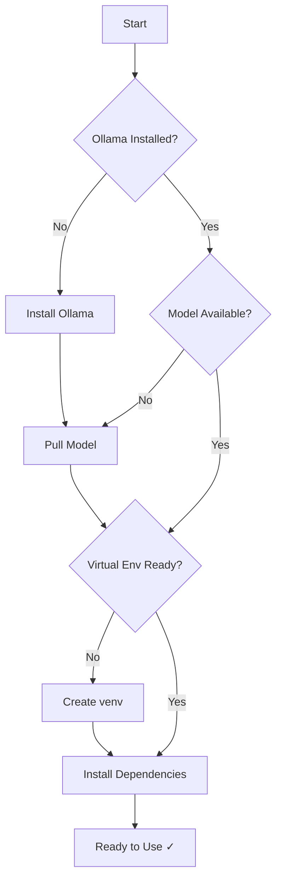

### Quick Start Commands

```bash
# 1. Navigate to the implementation
cd /home/tbaltzakis/ollama

# 2. Activate virtual environment
source .venv/bin/activate

# 3. Start Ollama server
./scripts/start-ollama.sh

# 4. Start the modern GUI
python3 gui.py
```

### Modern GUI Features

The GUI has been enhanced with a modern terminal interface featuring:
- **Box-drawing headers** - Clean, professional terminal design
- **Color-coded status** - Visual indicators for success/failure
- **NLP auto-detection** - Commands automatically understood
- **Structured help** - Organized command reference

```bash
# Start the GUI
python3 gui.py

# Then use natural language commands
> analyze codebase
> create API endpoint for users
> run tests and fix failures
```

---

## Project Setup

### Step 1: Configure Your Project

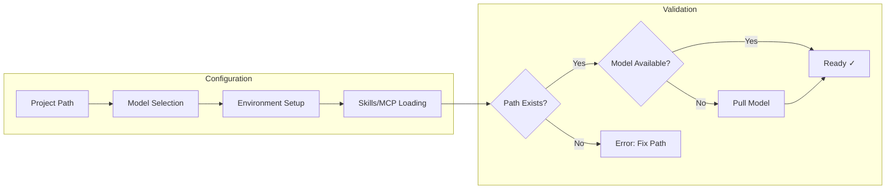

### Project Configuration Example

```python
from integrations.tdd_agent import TDDAgent, TDDConfig
from integrations.orchestrator_agent import Orchestrator, OrchestratorConfig

# Configure for your project
config = OrchestratorConfig(
    model="qwen2.5-coder",
    base_url="http://localhost:11434",
    project_path="/path/to/your/project",
    temperature=0.1,
)

# Create orchestrator
orchestrator = Orchestrator(config)
```

### Project-Specific Configurations

#### Using Project Picker

The project picker automatically scans `/home/tbaltzakis` for all projects:

```bash
# Run project picker
./scripts/project-picker.sh

# Example output:
# ━━━━━━━━━━━━━━━━━━━━━━━━━━━━━━━━━━━━━━━━━━━━━━━━━━━━━━━━━━━
#   DeepAgents + Ollama - Project Picker
# ━━━━━━━━━━━━━━━━━━━━━━━━━━━━━━━━━━━━━━━━━━━━━━━━━━━━━━━━━━━
#
# Available Projects:
#
#   1. cloudless.gr
#      Type: Next.js
#      Path: /home/tbaltzakis/cloudless.gr
#
#   2. Deep agents/deepagents
#      Type: Python
#      Path: /home/tbaltzakis/Deep agents/deepagents
#
#   3. my-fastapi-app
#      Type: FastAPI
#      Path: /home/tbaltzakis/my-fastapi-app
#
# Select a project (1-4):
```

**Supported Project Types:**
- Node.js: `package.json` → Next.js, React, Vue, Angular, Nuxt
- Python: `pyproject.toml`, `requirements.txt` → FastAPI, Django, Flask
- Rust: `Cargo.toml`
- Go: `go.mod`
- Java: `pom.xml`, `build.gradle`
- Any: `.git` directory, `.deepagents` directory

#### Next.js Project

```python
from integrations import Orchestrator

orchestrator = Orchestrator()

result = orchestrator.execute(
    task="Create a new API route for user authentication",
    mode="auto",
    context={
        "framework": "Next.js 14",
        "language": "TypeScript",
        "styling": "Tailwind CSS",
        "database": "PostgreSQL",
        "orm": "Prisma",
        "project_path": "/path/to/nextjs-app",
    },
)
```

#### Python FastAPI Project

```python
result = orchestrator.execute(
    task="Create a REST endpoint for user CRUD operations",
    mode="auto",
    context={
        "framework": "FastAPI",
        "language": "Python 3.11",
        "database": "PostgreSQL",
        "orm": "SQLAlchemy",
        "testing": "pytest",
        "project_path": "/path/to/fastapi-app",
    },
)
```

---

## Using the GUI (Modern Terminal Interface)

### Overview

The GUI provides a terminal-based interface with a modern box-drawing design for natural language agent interaction.

### Starting the GUI

```bash
cd /home/tbaltzakis/ollama
source .venv/bin/activate
python3 gui.py
```

### Modern UI Features

- **Box-drawing headers** - Professional terminal design with box characters
- **Color-coded status** - Visual indicators for success (green) and failure (red)
- **NLP auto-detection** - Commands automatically understood and routed
- **Structured help** - Organized command reference with categories

### Available Commands

#### Development Commands
- `Create a new [feature/component/API endpoint]`
- `Implement [functionality] with tests`
- `Add [feature] to [module]`
- `Refactor [code/module]`

#### Testing Commands
- `Run tests`
- `Run tests and fix failures`
- `Run build`
- `Check for errors`

#### Analysis Commands (NLP Auto-Detect)
- `Analyze codebase`
- `Check for issues`
- `Review code`

#### Code Generation (NLP Auto-Detect)
- `Create API endpoint`
- `Add component`
- `Build function`

#### Enhanced Research Commands
- `Research [topic]` - Multi-source research
- `Find documentation for [API/library]` - API docs
- `Search for [query]` - Web search

#### Multi-Agent Commands
- `Design [system] with multiple perspectives`
- `Storm [task] with all agents`
- `Analyze [feature] for security and performance`

#### Ollama Management
- `start ollama` - Start Ollama server
- `stop ollama` - Stop Ollama server
- `check ollama` - Check Ollama status
- `pull [model]` - Pull a new model
- `list models` - List available models

#### Project Management
- `connect [path]` - Connect to project
- `scan projects` - Scan for projects
- `current` - Show configuration

#### System Commands
- `help` - Show available commands
- `history` - Show command history
- `clear` - Clear screen
- `project` - Show project info
- `exit / quit` - Exit the GUI

### Example GUI Session

```python
# GUI Session Example

╔══════════════════════════════════════════════════════════╗
║ ┌─────────────────────────────────────────────┐          ║
║ │ DeepAgents + Ollama - AI Coding Assistant   │          ║
║ └─────────────────────────────────────────────┘          ║
╠══════════════════════════════════════════════════════════╣
║ ● Project: cloudless-app (Node.js)                       ║
║ ● Ollama: Running                                        ║
║ ● Model: qwen2.5-coder                                   ║
╚══════════════════════════════════════════════════════════╝

> analyze codebase
Analyzing codebase...
...
✓ Codebase analysis complete

> create API endpoint for users
Generating code...
...
✓ API endpoint created

> exit
Goodbye!
```

---

## Ollama Server Management

### GUI Commands

The GUI provides built-in Ollama server management capabilities:

```bash
# Start Ollama server
> start ollama
# Output: ✓ Ollama server started successfully

# Stop Ollama server
> stop ollama
# Output: ✓ Ollama server stopped

# Check Ollama status
> check ollama
# Output: ✓ Ollama is running
#         URL: http://localhost:11434
#         Available models: 3

# Pull a new model
> pull llama3.2
# Output: Pulling model: llama3.2
#         [progress bar]

# List available models
> list models
# Output:
#   1. qwen2.5-coder:latest
#   2. llama3.2:latest
```

### Programmatic Management

```python
from integrations import WebAgent, TerminalAgent

# Check if Ollama is running
web = WebAgent()
# Ollama server is checked in __init__

# Pull a model programmatically
terminal = TerminalAgent()

# Use shell commands to manage Ollama
terminal.execute("ollama pull llama3.2")
terminal.execute("ollama list")
```

---

## Project Connection

### GUI Commands

Connect to any project from the GUI:

```bash
# Connect to a project
> connect /home/user/my-project
# Output: ✓ Project set to: my-project (Node.js)

# Scan for projects
> scan projects
# Output:
#   Found 3 project(s):
#   
#   1. cloudless.gr
#      Type: Next.js
#      Path: /home/tbaltzakis/cloudless.gr
#   
#   2. my-api
#      Type: Python
#      Path: /home/tbaltzakis/my-api

# Show current project details
> current
# Output:
#   Current Configuration:
#     Project: cloudless.gr
#     Type: Next.js
#     Path: /home/tbaltzakis/cloudless.gr
#     Ollama: Running
#     Model: qwen2.5-coder
```

### Connecting to Projects

Projects are detected by common indicators:

| Indicator | Project Type |
|-----------|--------------|
| `package.json` | Node.js |
| `pyproject.toml` | Python |
| `requirements.txt` | Python |
| `Cargo.toml` | Rust |
| `go.mod` | Go |
| `.git` directory | Git repository |

```python
from integrations.terminal_agent import TerminalAgent

terminal = TerminalAgent()

# Set environment variables for project context
import os
os.environ['PROJECT_PATH'] = '/path/to/project'
os.environ['PROJECT_TYPE'] = 'Next.js'
os.environ['PROJECT_NAME'] = 'my-app'
```

---

## Working with TDD Agent

### TDD Workflow Overview

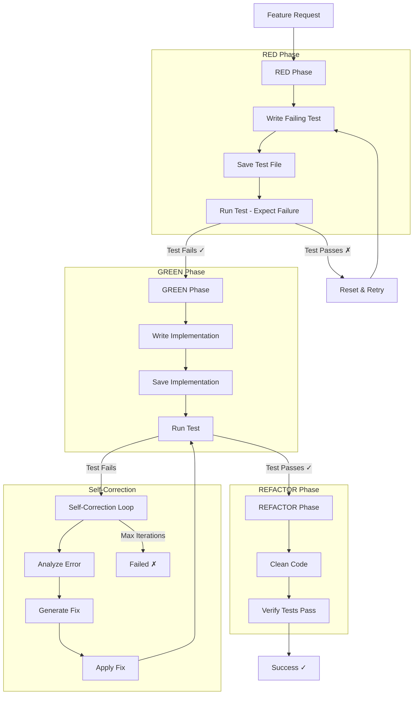

### Basic TDD Usage

```python
from integrations import TDDAgent

# Create TDD agent
tdd = TDDAgent()

# Run TDD cycle for a feature
result = tdd.run_tdd(
    feature="Create user authentication API endpoint with JWT tokens",
    test_file="src/api/auth/route.test.ts",
    implementation_file="src/api/auth/route.ts",
    test_command="pnpm test",
)

# Check result
if result["status"] == "success":
    print(f"✓ Feature implemented in {result['iterations']} iterations")
else:
    print(f"✗ Failed after {result['iterations']} iterations")
```

### TDD for Multiple Features

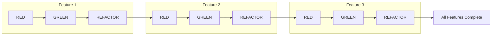

```python
from integrations import TDDAgent

tdd = TDDAgent()

# Define features to implement
features = [
    {
        "feature": "User registration endpoint",
        "test_file": "tests/test_registration.py",
        "impl_file": "src/routes/registration.py",
    },
    {
        "feature": "User login endpoint",
        "test_file": "tests/test_login.py",
        "impl_file": "src/routes/login.py",
    },
    {
        "feature": "Password reset endpoint",
        "test_file": "tests/test_password_reset.py",
        "impl_file": "src/routes/password_reset.py",
    },
]

# Implement each feature with TDD
results = []
for f in features:
    result = tdd.run_tdd(
        feature=f["feature"],
        test_file=f["test_file"],
        implementation_file=f["impl_file"],
    )
    results.append(result)
    print(f"{f['feature']}: {result['status']}")

# Summary
success_count = sum(1 for r in results if r["status"] == "success")
print(f"\nCompleted: {success_count}/{len(features)} features")
```

### TDD Configuration Options

```python
from integrations.tdd_agent import TDDAgent, TDDConfig

# Custom configuration for complex projects
config = TDDConfig(
    model="qwen2.5-coder",
    base_url="http://localhost:11434",
    project_path="/home/tbaltzakis/my-project",
    temperature=0.1,        # Low for precise code
    max_iterations=15,      # More iterations for complex features
    timeout=120,            # Longer timeout for slow tests
)

tdd = TDDAgent(config)
```

---

## Working with Agent Storm

### Agent Storm Overview

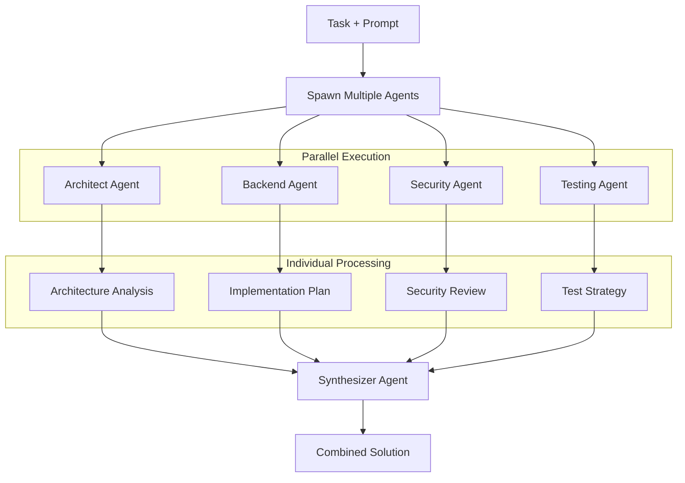

### Basic Agent Storm Usage

```python
from integrations import AgentStorm

storm = AgentStorm()

# Run parallel agent analysis
result = storm.storm(
    task="Design and implement a user authentication system",
    prompt="Consider security best practices, testability, and scalability",
    num_agents=4,
)

# Access synthesized result
print("Synthesized Solution:")
print(result["synthesis"]["synthesis"])

# Access individual agent outputs
for agent_result in result["individual_results"]:
    print(f"\n{agent_result['role'].upper()} Agent:")
    print(agent_result["output"][:500] + "...")
```

### Agent Storm with Specific Roles

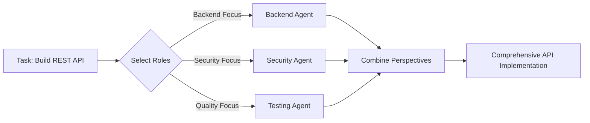

```python
from integrations import AgentStorm

storm = AgentStorm()

# Use specific roles for focused analysis
result = storm.storm_with_roles(
    task="Implement REST API for user management with CRUD operations",
    prompt="Focus on production-ready code with proper error handling",
    roles=["backend", "security", "testing"],
)

print(f"Used {result['num_agents']} agents")
print(f"Duration: {result['duration_seconds']:.2f}s")
print(result["synthesis"]["synthesis"])
```

### Parallel Subtask Execution

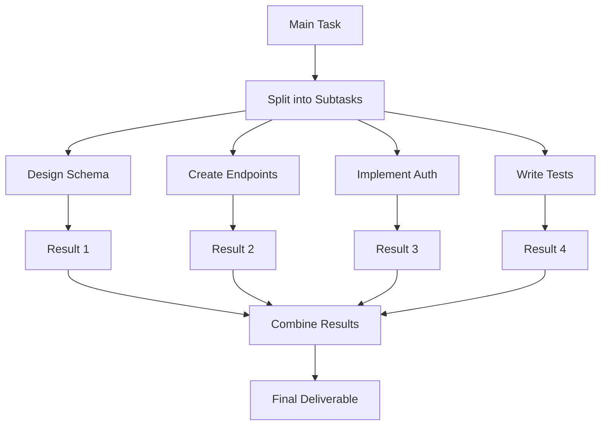

```python
from integrations import AgentStorm

storm = AgentStorm()

# Execute subtasks in parallel
result = storm.parallel_tasks(
    task="Build user management feature",
    subtasks=[
        "Design database schema for users table",
        "Create REST API endpoints for CRUD",
        "Implement JWT authentication middleware",
        "Write unit tests for user service",
        "Add integration tests for API endpoints",
    ],
)

# Check each subtask result
for r in result["results"]:
    status = "✓" if r["success"] else "✗"
    print(f"{status} {r['subtask']}")
    print(f"   Agent: {r['role']}")
```

### Custom Agent Roles

```python
from integrations.agent_storm import AgentStorm, AgentRole, AgentStormConfig

# Define custom roles for your domain
custom_roles = [
    AgentRole(
        name="api-designer",
        system_prompt="""You are an API Design Expert focusing on:
- RESTful best practices
- OpenAPI specifications
- Versioning strategies
- Rate limiting patterns""",
        focus="API design and documentation",
    ),
    AgentRole(
        name="database-architect",
        system_prompt="""You are a Database Architecture Expert focusing on:
- Schema design
- Query optimization
- Indexing strategies
- Data migration patterns""",
        focus="database schema and queries",
    ),
    AgentRole(
        name="performance-engineer",
        system_prompt="""You are a Performance Engineering Expert focusing on:
- Caching strategies
- Query optimization
- Load balancing
- Monitoring metrics""",
        focus="performance and optimization",
    ),
]

# Configure storm with custom roles
config = AgentStormConfig(
    model="qwen2.5-coder",
    num_agents=3,
    max_workers=3,
)

storm = AgentStorm(config)

result = storm.storm(
    task="Design high-throughput API for real-time analytics",
    prompt="Optimize for 10k requests/second with <50ms latency",
    custom_roles=custom_roles,
)
```

---

## Working with Orchestrator

### Orchestrator Mode Switching

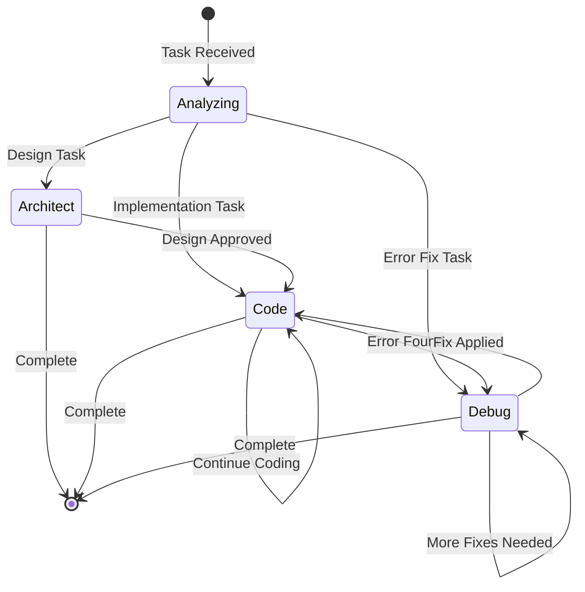

### Single Mode Usage

```python
from integrations import Orchestrator

orchestrator = Orchestrator()

# Architect mode - for planning
plan = orchestrator.execute(
    task="Design the architecture for a microservices-based e-commerce platform",
    mode="architect",
)
print(plan["output"])

# Code mode - for implementation
impl = orchestrator.execute(
    task="Implement the user service based on the architecture plan",
    mode="code",
    context={"architecture": plan["output"]},
)
print(impl["output"])

# Debug mode - for fixing issues
fix = orchestrator.execute(
    task="Fix the timeout error in the order processing service",
    mode="debug",
    context={
        "error": "ConnectionTimeout: Database query took 30s",
        "service": "order-service",
    },
)
print(fix["output"])
```

### Auto Mode (Recommended)

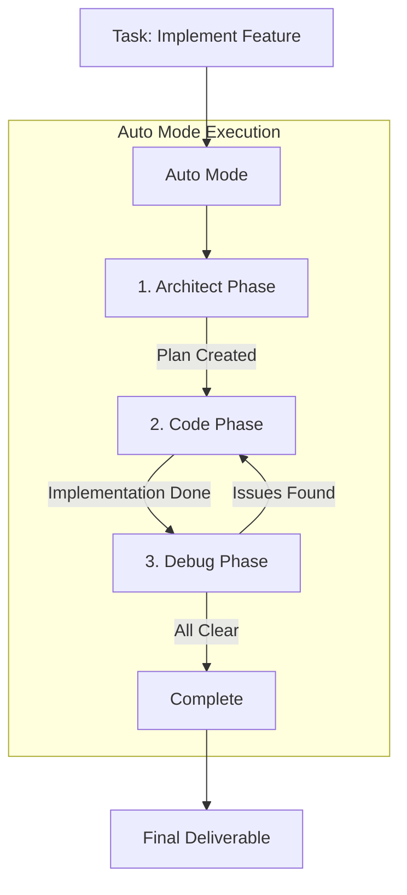

```python
from integrations import Orchestrator

orchestrator = Orchestrator()

# Auto mode handles the complete workflow
result = orchestrator.execute(
    task="Implement user registration with email verification",
    mode="auto",
    context={
        "project_path": "/path/to/project",
        "tech_stack": ["Next.js", "TypeScript", "PostgreSQL"],
    },
)

# Access stages
for stage in result["stages"]:
    print(f"\n=== {stage['mode'].upper()} PHASE ===")
    print(stage["output"][:500])

# Final output
print("\n=== FINAL RESULT ===")
print(result["final_output"])
```

### Passing Context Between Modes

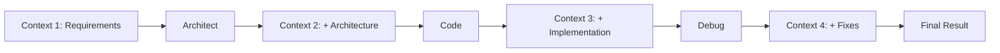

```python
from integrations import Orchestrator

orchestrator = Orchestrator()

# Build context progressively
context = {
    "requirements": [
        "User can register with email",
        "Email verification required",
        "Password must meet complexity rules",
    ],
}

# Architect phase
arch_result = orchestrator.execute(
    task="Design user registration system",
    mode="architect",
    context=context,
)
context["architecture"] = arch_result["output"]

# Code phase
code_result = orchestrator.execute(
    task="Implement the registration system",
    mode="code",
    context=context,
)
context["implementation"] = code_result["output"]

# Debug phase
debug_result = orchestrator.execute(
    task="Verify implementation and fix issues",
    mode="debug",
    context=context,
)

print(debug_result["output"])
```

---

## Working with Web Agent

### Web Agent Capabilities

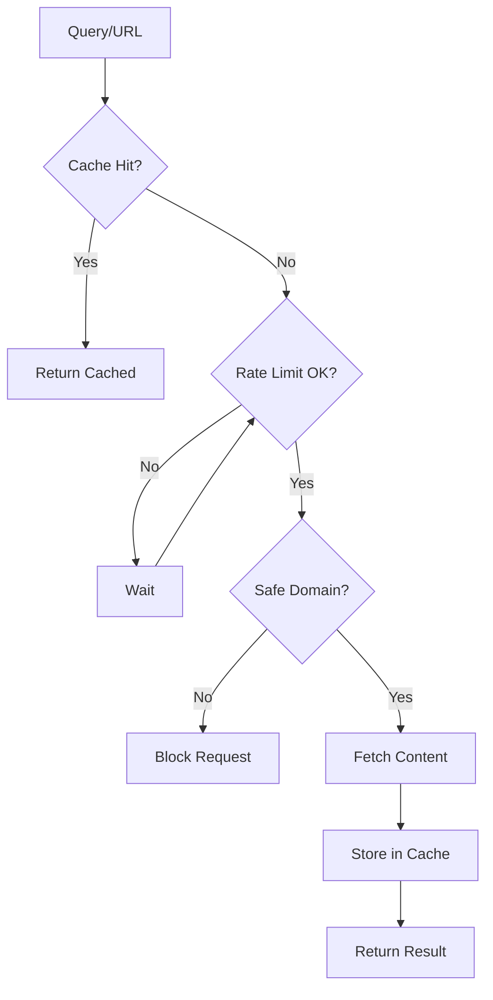

### Enhanced Research Capabilities

**New in v2.0:**
- **Interactive web search** - Select URLs from search results for detailed fetching
- **Multiple search sources** - DuckDuckGo, Bing, Google Custom Search fallback
- **Enhanced summaries** - Full source summaries with content previews
- **Kiro web_fetch integration** - Direct access to Kiro's built-in web_fetch tool
- **Content negotiation** - Automatic markdown fetching when supported

### Research for Development

```python
from integrations import WebAgent

web = WebAgent()

# Research a topic before implementation
research = web.research("Next.js 14 server actions best practices", sources=3)

print(f"Topic: {research['topic']}")
print(f"\nSources used:")
for source in research["sources_used"]:
    print(f"  - {source['title']}: {source['url']}")

print(f"\nKey findings:")
for finding in research["key_findings"][:5]:
    print(f"  • {finding}")

print(f"\nFull summaries:")
for summary in research["summaries"]:
    print(f"  [{summary['source']}]")
    print(f"  {summary['summary'][:200]}...")
```

### Fetching Documentation

```python
from integrations import WebAgent

web = WebAgent()

# Get API documentation
docs = web.get_api_docs("stripe")
if docs["success"]:
    print(docs["content"][:2000])

# Fetch specific page with content negotiation
page = web.fetch("https://nextjs.org/docs/app/building-your-application/routing")
if page["success"]:
    print(page["content"][:3000])

# Fetch selective content
selective = web.fetch_selective(
    "https://docs.langchain.com/docs/integrations/llms",
    "chat model"
)
print(selective["content"])
```

### Using Research in Development

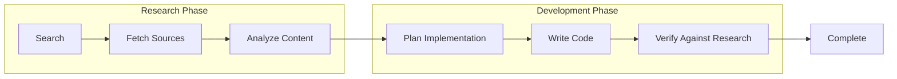

```python
from integrations import WebAgent, Orchestrator

web = WebAgent()
orchestrator = Orchestrator()

# Step 1: Research
research = web.research("DynamoDB single-table design patterns", sources=3)

# Step 2: Plan with research context
plan = orchestrator.execute(
    task="Design DynamoDB schema for e-commerce application",
    mode="architect",
    context={
        "research": research["key_findings"],
        "requirements": [
            "Users, Orders, Products entities",
            "Query by user orders",
            "Query by product category",
        ],
    },
)

# Step 3: Implement
impl = orchestrator.execute(
    task="Implement DynamoDB access patterns",
    mode="code",
    context={"plan": plan["output"]},
)

print(impl["output"])
```

### Interactive Web Search (GUI Only)

The GUI provides an interactive mode for web search with URL selection:

```bash
# In the GUI, use:
> interactive search Next.js API patterns
> 3  # Select URL #3 to fetch in detail
```

**Features:**
- View search results with titles and URLs
- Select specific URLs to fetch
- Or fetch all results with `all`
- Content preview with source attribution

---

## Working with the GUI (Natural Language Interface)

### Overview

The GUI provides a terminal-based interface for natural language agent interaction. It supports web research, multi-agent workflows, and code generation through intuitive commands.

### Starting the GUI

```bash
cd /home/tbaltzakis/ollama
source .venv/bin/activate
python3 gui.py
```

### Available Commands

#### Development Commands
- `Create a new [feature/component/API endpoint]`
- `Implement [functionality] with tests`
- `Add [feature] to [module]`
- `Refactor [code/module]`

#### Testing Commands
- `Run tests`
- `Run tests and fix failures`
- `Run build`
- `Check for errors`

#### Analysis Commands
- `Review [code/module]`
- `Analyze [file] for issues`
- `Explain [code/concept]`
- `What is [concept]?`

#### Enhanced Research Commands
- `Research [topic]` - Comprehensive multi-source research
- `Find documentation for [API/library]` - API documentation lookup
- `Search for [query]` - Web search results
- `Interactive search [query]` - Select URLs from results

#### Multi-Agent Commands
- `Design [system] with multiple perspectives`
- `Storm [task] with all agents`
- `Analyze [feature] for security and performance`

#### System Commands
- `help` - Show available commands
- `history` - Show command history
- `clear` - Clear screen
- `project` - Show project info
- `exit / quit` - Exit the GUI

### Example GUI Session

```python
# GUI Session Example

You: Research Next.js 14 server actions
[GUI Researching: Next.js 14 server actions]
Sources:
  - Next.js Server Actions: https://nextjs.org/docs/app
  - Server Actions Documentation: https://react.dev

Key Findings:
  - Server actions allow running code on the server
  - They support streaming and partial rendering
  - Perfect for form submissions and data mutations

You: Design user authentication with multiple perspectives
[GUI Designing with multiple perspectives...]
[Agent Storm running with architect, security, testing agents]
Synthesized Solution: Comprehensive authentication system with JWT...

You: Exit
Goodbye!
```

---

## Working with Debug Agent

---

## Working with Debug Agent

### Debug Workflow

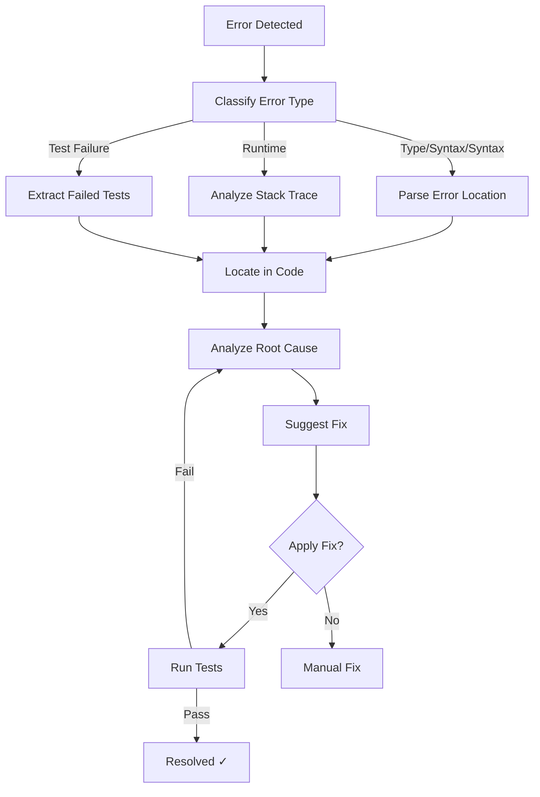

### Error Analysis

```python
from integrations import DebugAgent

debugger = DebugAgent()

# Sample error output
error = """
TypeError: Cannot read properties of undefined (reading 'id')
    at UserController.getUser (src/controllers/user.ts:25:15)
    at processTicksAndRejections (node:internal/process/task_queues:95:5)
"""

# Analyze the error
diagnosis = debugger.analyze_error(error, "src/controllers/user.ts")

print(f"Error Type: {diagnosis['error_type']}")
print(f"Severity: {diagnosis['severity']}")
print(f"Root Cause: {diagnosis['root_cause']}")
print(f"Location: {diagnosis['location']}")
print(f"Suggested Fix: {diagnosis['suggested_fix']}")
```

### Log Analysis

```python
from integrations import DebugAgent

debugger = DebugAgent()

# Analyze application logs
analysis = debugger.analyze_logs("/var/log/app.log", max_lines=1000)

print(f"Total Lines: {analysis['total_lines']}")
print(f"Summary: {analysis['summary']}")

for pattern in analysis["patterns_detected"]:
    print(f"\n{pattern['pattern'].upper()}: {pattern['count']} occurrences")
    for example in pattern["examples"][:2]:
        print(f"  - {example[:100]}...")
```

### Self-Fix Integration

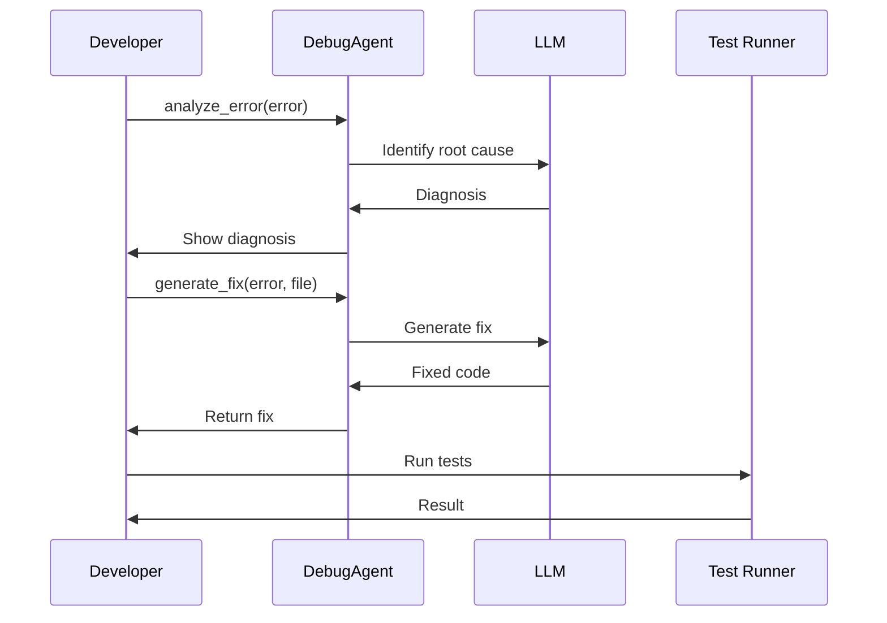

```python
from integrations import DebugAgent, SandboxAgent

debugger = DebugAgent()
sandbox = SandboxAgent()

# Run tests
result = sandbox.execute("pnpm test")

if not result["success"]:
    # Analyze error
    diagnosis = debugger.analyze_error(
        result["stderr"],
        file_path=None,
    )
    
    print(f"Found {diagnosis['severity']} issue:")
    print(diagnosis["root_cause"])
    print(f"\nSuggested fix:\n{diagnosis['suggested_fix']}")
    
    # Generate fix for specific file
    if diagnosis["location"]["file"] != "unknown":
        fix = debugger.generate_fix(
            result["stderr"],
            diagnosis["location"]["file"],
        )
        print(f"\nGenerated fix:\n{fix}")
```

---

## Terminal & Sandbox Operations

### Terminal vs Sandbox

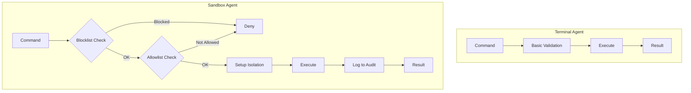

### Terminal Agent Usage

```python
from integrations import TerminalAgent

terminal = TerminalAgent()

# Execute command
result = terminal.execute("pnpm test")

if result["success"]:
    print(f"✓ Tests passed")
    print(result["stdout"])
else:
    print(f"✗ Tests failed")
    print(result["stderr"])

# Parse test output
parsed = terminal.parse_output(result["stdout"], output_type="test")
print(f"Passed: {parsed['summary'].get('passed', 0)}")
print(f"Failed: {parsed['summary'].get('failed', 0)}")

# Get execution history
history = terminal.get_history(limit=5)
for entry in history:
    print(f"{entry['timestamp']}: {entry['command']}")
```

### Sandbox Agent Usage

```python
from integrations import SandboxAgent

sandbox = SandboxAgent()

# Execute in sandbox
result = sandbox.execute("pnpm build")
print(f"Build: {'SUCCESS' if result['success'] else 'FAILED'}")

# Try dangerous command (will be blocked)
result = sandbox.execute("rm -rf /")
print(result["error"])  # "Blocked: 'rm -rf'"

# Check audit log
audit = sandbox.get_audit_log()
for entry in audit:
    print(f"{entry['timestamp']} [{entry['type']}] {entry['status']}: {entry['command']}")

# Get statistics
stats = sandbox.get_statistics()
print(f"Blocked: {stats['blocked_commands']}")
print(f"Success rate: {stats['success_rate']:.1%}")
```

### Safe Command Execution

```python
from integrations import SandboxAgent

sandbox = SandboxAgent()

# Execute with validated arguments
result = sandbox.execute_safe(
    command="git",
    args=["checkout", "feature-branch"],
)

# Arguments are validated for:
# - No shell injection characters: ; | & $ ` > <
# - No path traversal: ..

# This would fail:
result = sandbox.execute_safe(
    command="git",
    args=["checkout", "; rm -rf /"],  # Blocked
)
```

---

## Complete Workflows

### Workflow 1: New Feature Development

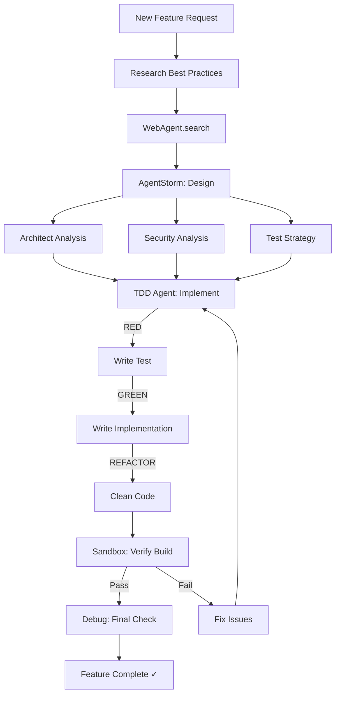

```python
from integrations import (
    WebAgent,
    AgentStorm,
    TDDAgent,
    SandboxAgent,
    DebugAgent,
)

# Initialize agents
web = WebAgent()
storm = AgentStorm()
tdd = TDDAgent()
sandbox = SandboxAgent()
debugger = DebugAgent()

# Step 1: Research
print("Step 1: Researching...")
research = web.research("JWT authentication best practices", sources=3)

# Step 2: Design with Agent Storm
print("Step 2: Designing...")
design = storm.storm_with_roles(
    task="Design JWT authentication for REST API",
    prompt="Use research findings",
    roles=["architect", "security", "testing"],
)

# Step 3: Implement with TDD
print("Step 3: Implementing...")
impl = tdd.run_tdd(
    feature="JWT authentication middleware",
    test_file="src/middleware/auth.test.ts",
    implementation_file="src/middleware/auth.ts",
)

# Step 4: Verify with Sandbox
print("Step 4: Verifying...")
build = sandbox.execute("pnpm build")
test = sandbox.execute("pnpm test")

if build["success"] and test["success"]:
    # Step 5: Final check
    print("Step 5: Final check...")
    diagnosis = debugger.analyze_logs("app.log")
    print(f"Log analysis: {diagnosis['summary']}")
    
    print("\n✓ Feature complete!")
else:
    print(f"\n✗ Build failed" if not build["success"] else "\n✗ Tests failed")
```

### Workflow 2: Bug Fixing

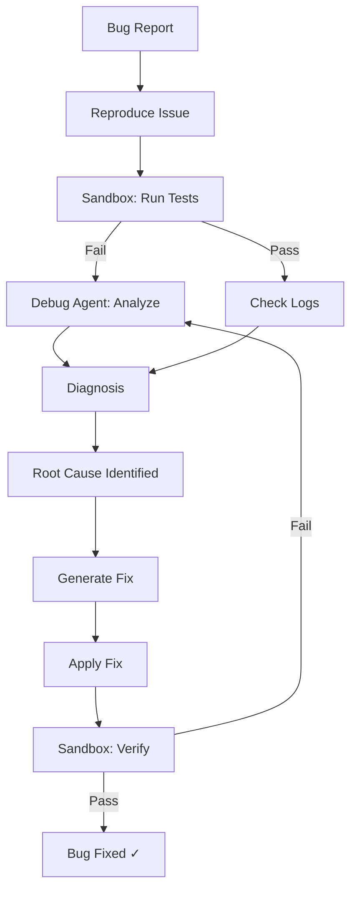

```python
from integrations import SandboxAgent, DebugAgent

sandbox = SandboxAgent()
debugger = DebugAgent()

# Reproduce the bug
result = sandbox.execute("pnpm test -- --grep 'authentication'")

if not result["success"]:
    # Analyze error
    diagnosis = debugger.analyze_error(
        result["stderr"],
        file_path="src/auth/login.ts",
    )
    
    print(f"Issue: {diagnosis['root_cause']}")
    print(f"Severity: {diagnosis['severity']}")
    print(f"Location: {diagnosis['location']}")
    
    # Generate fix
    fix = debugger.generate_fix(
        result["stderr"],
        diagnosis["location"]["file"],
    )
    
    print(f"\nSuggested fix:\n{fix}")
    
    # After manually applying fix or using self_fix:
    verify = sandbox.execute("pnpm test")
    if verify["success"]:
        print("\n✓ Bug fixed!")
```

### Workflow 3: Code Review

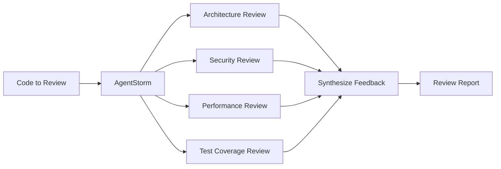

```python
from integrations import AgentStorm

storm = AgentStorm()

# Run multi-perspective code review
review = storm.storm_with_roles(
    task="Review the authentication module implementation",
    prompt="Check for security issues, performance, and test coverage",
    roles=["architect", "security", "testing"],
)

print("CODE REVIEW REPORT")
print("=" * 50)
print(review["synthesis"]["synthesis"])

# Access individual reviews
for r in review["individual_results"]:
    print(f"\n{'=' * 50}")
    print(f"{r['role'].upper()} REVIEW")
    print("=" * 50)
    print(r["output"])
```

---

## Best Practices

### 1. Always Start with Research

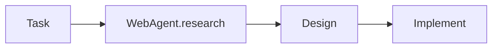

### 2. Use TDD for New Features

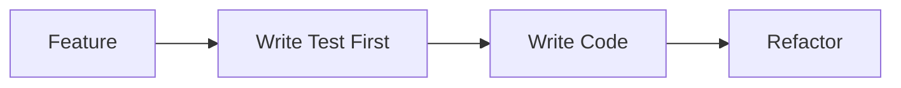

### 3. Use Sandbox for Verification

```mermaid
flowchart LR
    CODE[Code] --> BUILD[Sandbox: Build]
    BUILD --> TEST[Sandbox: Test]
    TEST --> LINT[Sandbox: Lint]
```

### 4. Use Agent Storm for Complex Tasks

```mermaid
flowchart LR
    COMPLEX[Complex Task] --> STORM[AgentStorm]
    STORM --> ARCH[Architect]
    STORM --> IMPL[Implementer]
    STORM --> SEC[Security]
    STORM --> TEST[Tester]
```

### 5. Use Orchestrator Auto Mode

```python
# Instead of managing modes manually:
result = orchestrator.execute(task, mode="auto")  # Let it manage itself

# Rather than:
plan = orchestrator.execute(task, mode="architect")
impl = orchestrator.execute(task, mode="code", context={"plan": plan["output"]})
fix = orchestrator.execute(task, mode="debug", context={"impl": impl["output"]})
```

### 6. Check Audit Logs

```python
# Always check sandbox audit logs for security
sandbox = SandboxAgent()
result = sandbox.execute("some-command")

if not result["success"]:
    audit = sandbox.get_audit_log()
    for entry in audit:
        if entry["type"] == "BLOCKED":
            print(f"Security: {entry['reason']}")
```

### 7. Use Context Objects

```python
# Pass context between operations
context = {
    "project_path": "/path/to/project",
    "tech_stack": ["Next.js", "TypeScript"],
    "requirements": ["Feature 1", "Feature 2"],
}

# Research
research = web.research("...")
context["research"] = research["key_findings"]

# Design
design = storm.storm(task, context=context)
context["design"] = design["synthesis"]["synthesis"]

# Implement
impl = orchestrator.execute(task, context=context)
```

---

## Quick Reference

### Common Commands

| Task | Agent | Method |
|------|-------|--------|
| Research topic | WebAgent | `research(topic)` |
| Search web | WebAgent | `search(query)` |
| Interactive search | WebAgent | `fetch(url)` after search |
| Design solution | AgentStorm | `storm(task, prompt)` |
| Implement feature | TDDAgent | `run_tdd(feature, test, impl)` |
| Execute command | SandboxAgent | `execute(command)` |
| Fix bug | DebugAgent | `analyze_error(error)` |
| Orchestrate task | Orchestrator | `execute(task, mode="auto")` |

### GUI Commands

| Command | Description |
|---------|-------------|
| `Research [topic]` | Multi-source research with summaries |
| `Interactive search [query]` | Select URLs from search results |
| `Find documentation for [API]` | API documentation lookup |
| `Search for [query]` | Web search results |
| `Design [system] with multiple perspectives` | Multi-agent design analysis |
| `Storm [task] with all agents` | Parallel multi-agent execution |
| `help` | Show available commands |
| `history` | Show command history |
| `clear` | Clear screen |
| `project` | Show project info |
| `exit / quit` | Exit GUI |

### Mode Selection Guide

| Task Type | Recommended Mode |
|-----------|-----------------|
| New feature | `auto` (full cycle) |
| Architecture design | `architect` |
| Code implementation | `code` |
| Bug fixing | `debug` |
| Research only | WebAgent + AgentStorm |
| Interactive web search | GUI with `interactive search` |

### Agent Selection Guide

```mermaid
flowchart TD
    START[What do you need?] --> Q1{Write code?}
    
    Q1 --> |Yes| Q2{New feature?}
    Q1 --> |No| Q3{Analyze?}
    
    Q2 --> |Yes| TDD[TDDAgent]
    Q2 --> |No| Q4{Fix bug?}
    
    Q4 --> |Yes| DEBUG[DebugAgent]
    Q4 --> |No| CODE[Orchestrator: code mode]
    
    Q3 --> |Yes| Q5{Research?}
    Q3 --> |No| EXEC[Execute commands]
    
    Q5 --> |Yes| WEB[WebAgent]
    Q5 --> |No| Q6{Multiple perspectives?}
    
    Q6 --> |Yes| STORM[AgentStorm]
    Q6 --> |No| ORCH[Orchestrator]
    
    EXEC --> SAFE{Security needed?}
    SAFE --> |Yes| SANDBOX[SandboxAgent]
    SAFE --> |No| TERMINAL[TerminalAgent]
```

---

## Script Reference

### project-picker.sh

Automatically scans `/home/tbaltzakis` for projects.

**Usage:**
```bash
./scripts/project-picker.sh           # Scan and select project
./scripts/project-picker.sh --rescan  # Force rescan
./scripts/project-picker.sh --help    # Show help
```

**Project Detection:**
- Node.js: `package.json` → Next.js, React, Vue, Angular, Nuxt
- Python: `pyproject.toml`, `requirements.txt` → FastAPI, Django, Flask
- Rust: `Cargo.toml`
- Go: `go.mod`
- Java: `pom.xml`, `build.gradle`
- Any: `.git` directory, `.deepagents` directory

**Output:**
- Creates `.project_env` with:
  - `PROJECT_NAME`
  - `PROJECT_PATH`
  - `PROJECT_TYPE`
  - `DEEP_AGENTS_PROJECT_ROOT`

### start-ollama.sh

Starts Ollama server and displays available models.

### start-agent.sh

Tests the DeepAgents + Ollama connection.

### test-agent.sh

Runs a simple test query against the agent.

### test-project.sh

Tests the agent with the selected project environment.

### stop-ollama.sh

Stops the Ollama server.
