# Architecture Documentation

## System Overview

DeepAgents + Ollama Integration is a production-ready coding agent system that combines the power of local LLM inference with sophisticated agent orchestration patterns.

## High-Level Architecture

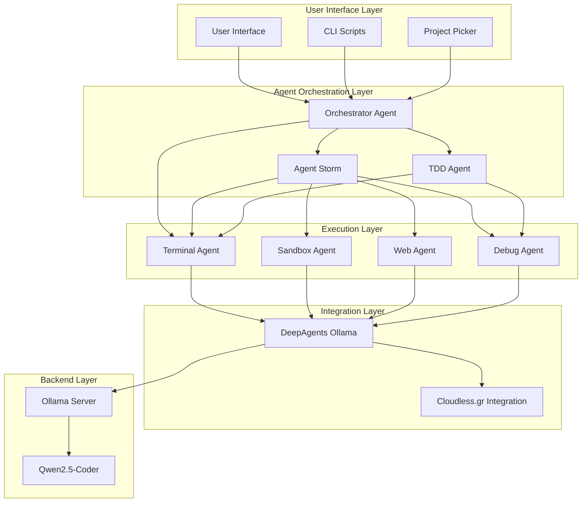

## Component Architecture

### 1. Orchestrator Agent

The central coordination hub that manages agent mode switching and task decomposition.

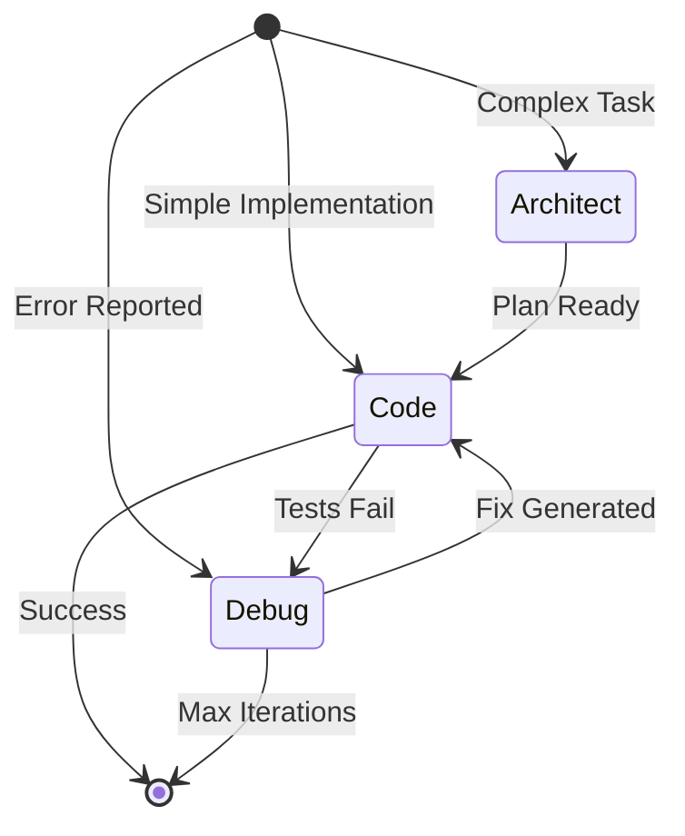

**Modes:**
- **Architect Mode**: System design, planning, high-level decisions
- **Code Mode**: Implementation, refactoring, file operations
- **Debug Mode**: Error analysis, log parsing, fix generation
- **Auto Mode**: Automatic mode switching based on task context

### 2. Agent Storm Pattern

Parallel multi-agent execution for comprehensive problem solving.

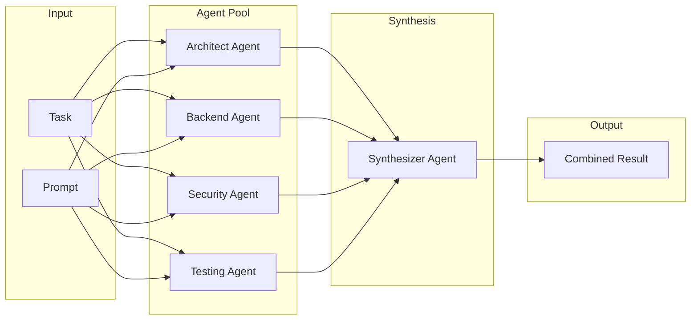

**Agent Roles:**

| Role | Focus Area | System Prompt Focus |
|------|------------|---------------------|
| Architect | System design, patterns, scalability | High-level structure |
| Backend | API, database, business logic | Implementation details |
| Security | Vulnerabilities, auth, compliance | Security best practices |
| Testing | Coverage, edge cases, automation | Test strategy |
| Frontend | UI, UX, accessibility | Component design |
| DevOps | Infrastructure, deployment, CI/CD | Operational concerns |

### 3. TDD Agent

Test-Driven Development with autonomous self-correction.

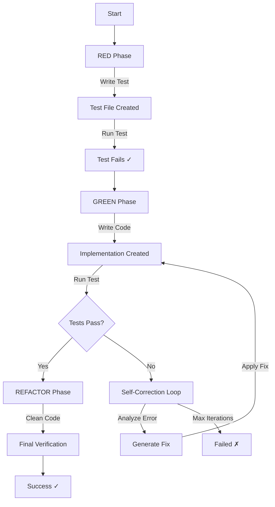

**Configuration:**

```python
TDDConfig(
    model="qwen2.5-coder",
    base_url="http://localhost:11434",
    project_path="/path/to/project",
    temperature=0.1,          # Low for precise coding
    max_iterations=10,        # Self-correction limit
    timeout=60,               # Per-iteration timeout
)
```

### 4. Terminal & Sandbox Agents

Secure command execution with layered security.

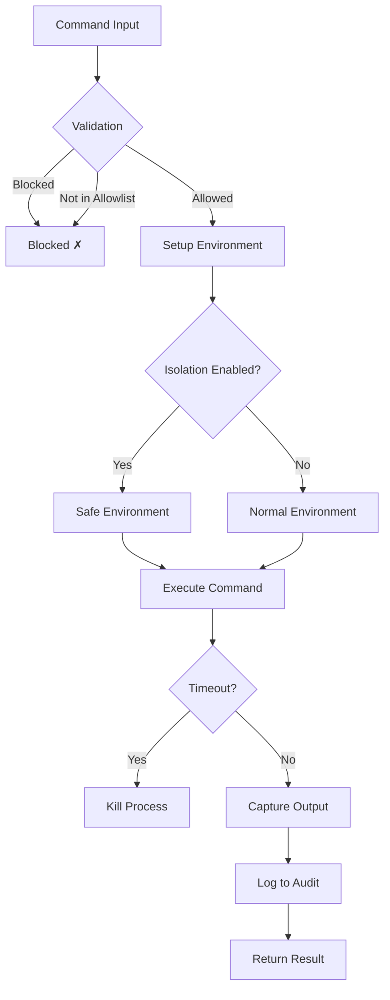

**Security Layers:**

1. **Command Blocklist**: Dangerous commands always blocked
   - `rm -rf`, `mkfs`, `dd`, `sudo`, `chmod 777`, etc.

2. **Command Allowlist**: Only approved commands allowed
   - `npm`, `pnpm`, `node`, `python`, `git`, `ls`, etc.

3. **Environment Isolation**: Clean environment variables
   - Strips `LD_PRELOAD`, `PYTHONPATH`, etc.
   - Sets minimal `PATH`

4. **Audit Logging**: Complete execution tracking
   - Timestamp, command, exit code, output size
   - Written to `/tmp/sandbox_audit.log`

### 5. Web Agent

Internet communication with safety controls.

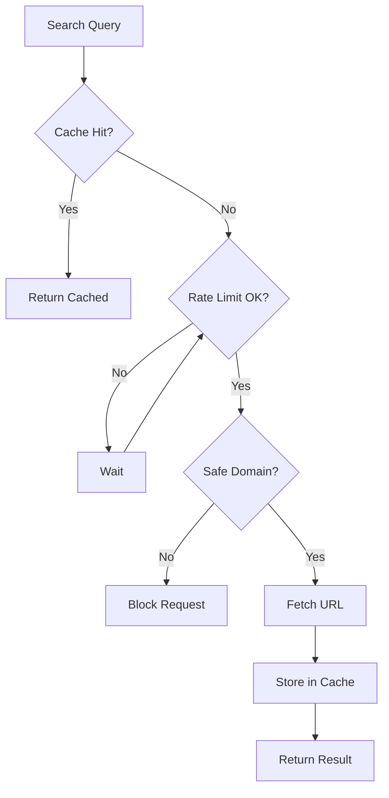

**Safe Domains:**
- `docs.langchain.com`
- `nextjs.org`
- `react.dev`
- `typescriptlang.org`
- `stripe.com`
- `aws.amazon.com`
- `github.com`
- `stackoverflow.com`
- `wikipedia.org`

## Data Flow

### Request Processing Flow

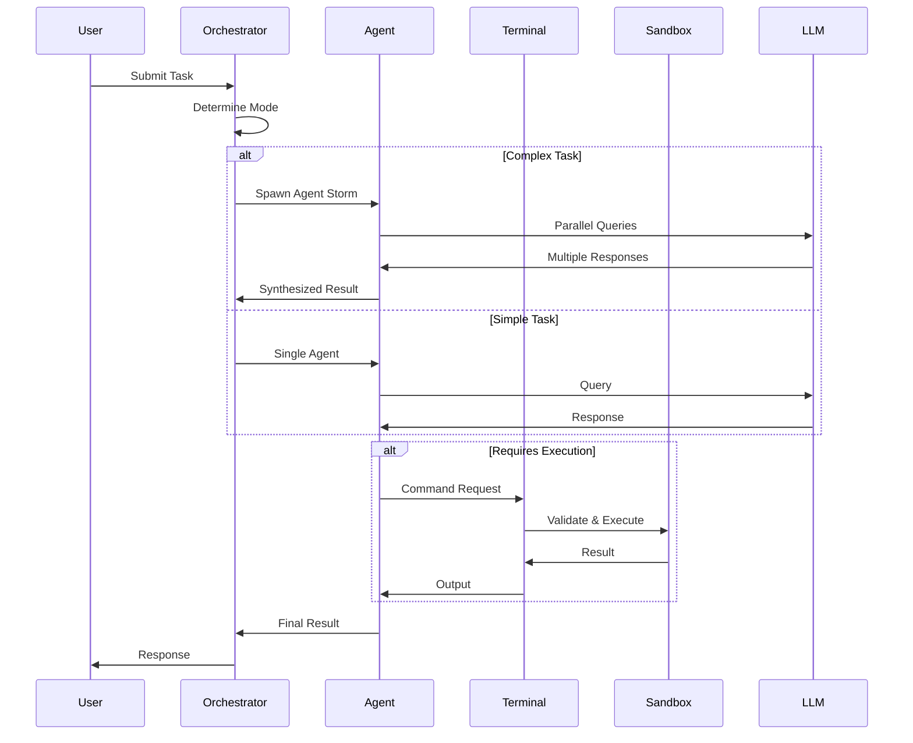

### TDD Workflow Sequence

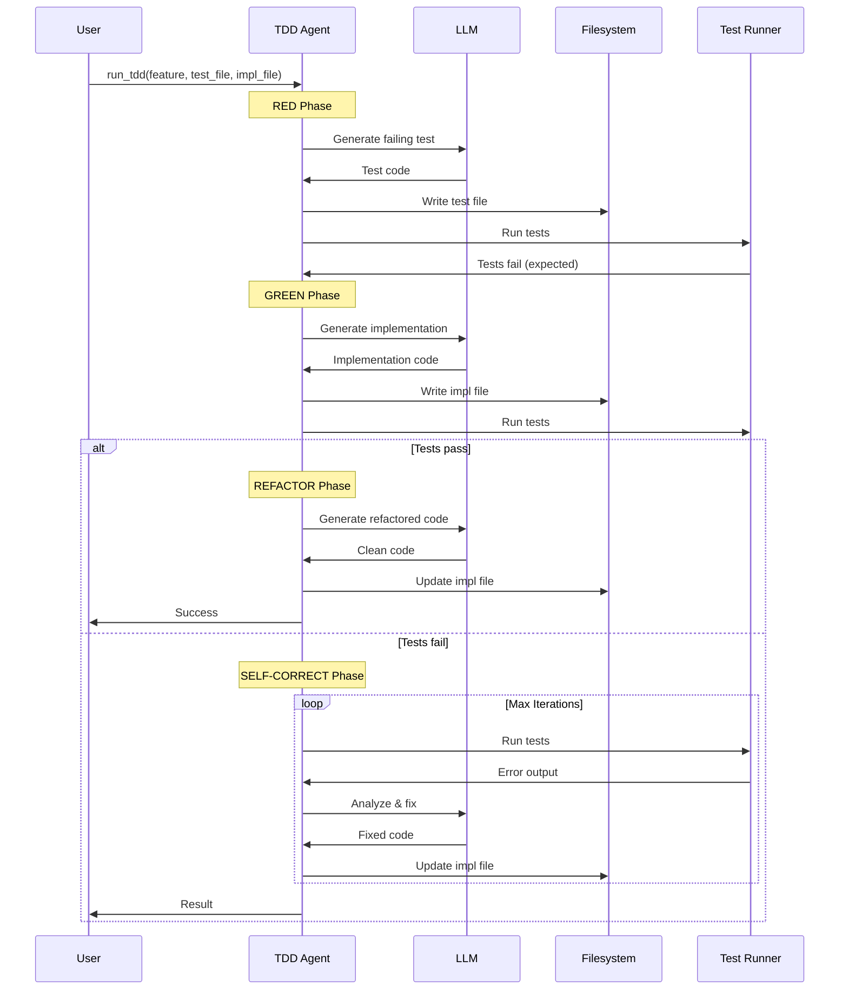

## Integration Points

### DeepAgents SDK Integration

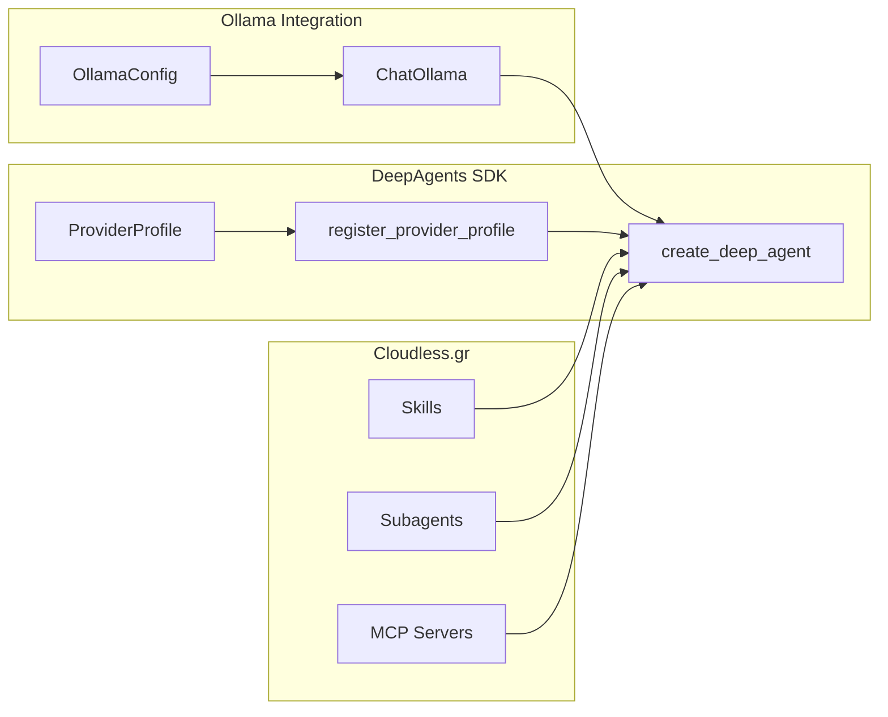

### LangChain Integration

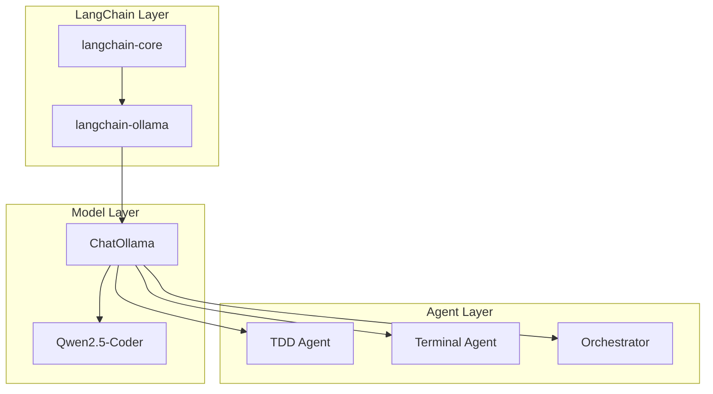

## Deployment Architecture

### Local Development

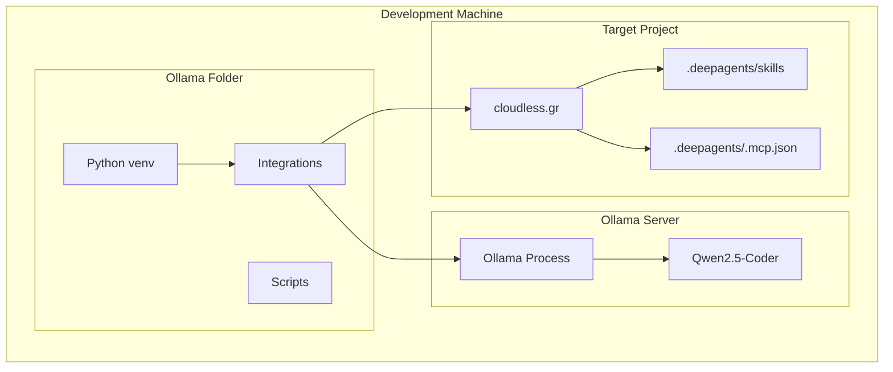

### Production Deployment (Future)

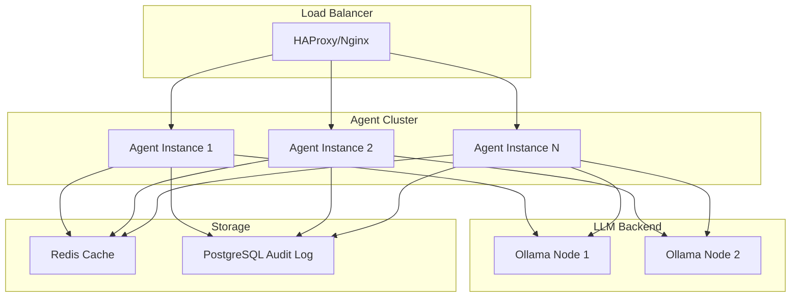

## Configuration Schema

### TDDConfig

```yaml
model: string          # LLM model name
base_url: string       # Ollama server URL
project_path: string   # Target project path
temperature: float     # Generation temperature (0.0-1.0)
max_iterations: int    # Self-correction limit
timeout: int           # Per-iteration timeout (seconds)
```

### TerminalConfig

```yaml
project_path: string   # Working directory
sandbox: bool          # Enable sandbox mode
allowlist: [string]    # Allowed commands
blocklist: [string]    # Blocked commands
timeout: int           # Command timeout
max_retries: int       # Retry attempts
```

### SandboxConfig

```yaml
project_path: string
allow_dangerous: bool
enable_isolation: bool
max_output_size: int
timeout: int
audit_log_path: string
allowlist: [string]
blocklist: [string]
```

### WebConfig

```yaml
rate_limit: int        # Requests per minute
timeout: int           # Request timeout
max_retries: int       # Retry attempts
cache_dir: string      # Cache directory
safe_domains: [string] # Allowed domains
```

### AgentStormConfig

```yaml
model: string
base_url: string
project_path: string
temperature: float
num_agents: int        # Number of parallel agents
max_workers: int       # ThreadPool workers
synthesizer_model: string
timeout: int           # Total timeout
```
