# Agent Workflows Documentation

This document describes the workflows and patterns implemented in the DeepAgents + Ollama integration.

## Table of Contents

1. [TDD Workflow](#tdd-workflow)
2. [Agent Storm Workflow](#agent-storm-workflow)
3. [Orchestrator Workflow](#orchestrator-workflow)
4. [Terminal/Sandbox Workflow](#terminalsandbox-workflow)
5. [Debug Workflow](#debug-workflow)
6. [Web Research Workflow](#web-research-workflow)

---

## TDD Workflow

### Overview

Test-Driven Development (TDD) is a software development approach where tests are written before the implementation. The TDD Agent automates this process with self-correction capabilities.

### The Red-Green-Refactor Cycle

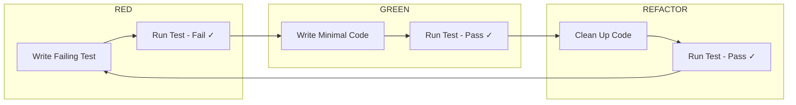

### Detailed Workflow

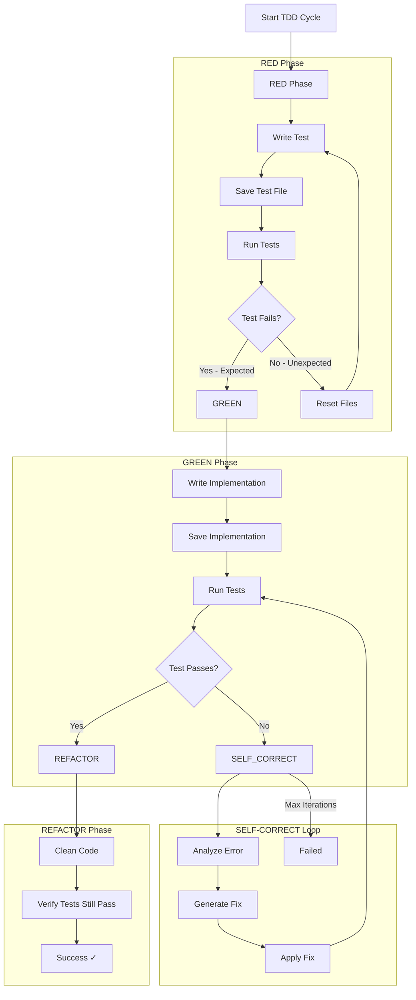

### Usage Example

```python
from integrations import TDDAgent
from integrations.tdd_agent import TDDConfig

# Configure the agent
config = TDDConfig(
    model="qwen2.5-coder",
    base_url="http://localhost:11434",
    project_path="/home/tbaltzakis/cloudless.gr",
    max_iterations=10,
    timeout=60,
)

# Create the agent
tdd = TDDAgent(config)

# Run TDD cycle
result = tdd.run_tdd(
    feature="Create a user authentication API endpoint",
    test_file="src/app/api/auth/route.test.ts",
    implementation_file="src/app/api/auth/route.ts",
    test_command="pnpm test",
)

# Check result
if result["status"] == "success":
    print(f"Completed in {result['iterations']} iterations")
else:
    print(f"Failed after {result['iterations']} iterations")
```

### Self-Correction Process

When tests fail during the GREEN phase, the agent enters a self-correction loop:

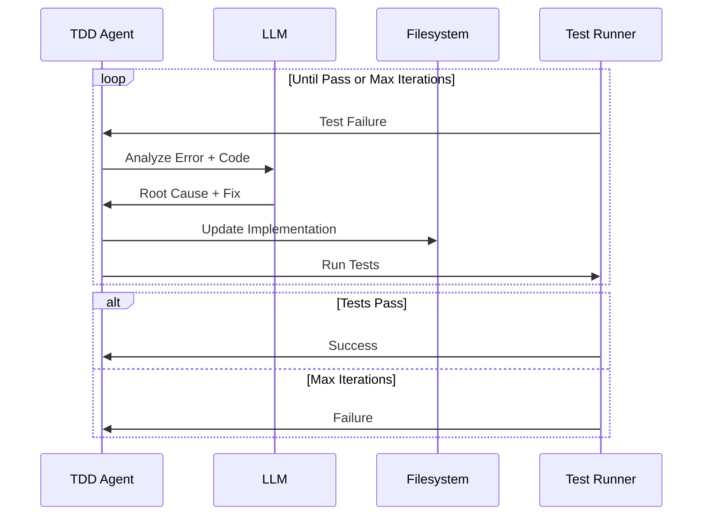

### Best Practices

1. **Feature Descriptions**: Be specific about expected behavior
2. **Test File Location**: Follow project conventions
3. **Test Command**: Use project's standard test runner
4. **Max Iterations**: Set based on complexity (5-15 recommended)
5. **Temperature**: Use low values (0.1-0.2) for precise code generation

---

## Agent Storm Workflow

### Overview

Agent Storm is a parallel multi-agent execution pattern that spawns multiple specialized agents to work on different aspects of a task simultaneously, then synthesizes their outputs.

### Pattern Overview

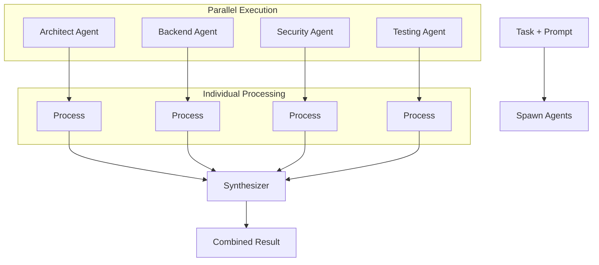

### Agent Roles

| Role | Focus | Example Use |
|------|-------|-------------|
| **Architect** | System design, patterns, scalability | Designing microservices architecture |
| **Backend** | API, database, business logic | Implementing REST endpoints |
| **Security** | Vulnerabilities, auth, compliance | Security audit of auth flow |
| **Testing** | Coverage, edge cases, automation | Test strategy for new feature |
| **Frontend** | UI components, UX, accessibility | Building form components |
| **DevOps** | Infrastructure, deployment, CI/CD | Setting up deployment pipeline |

### Workflow Execution

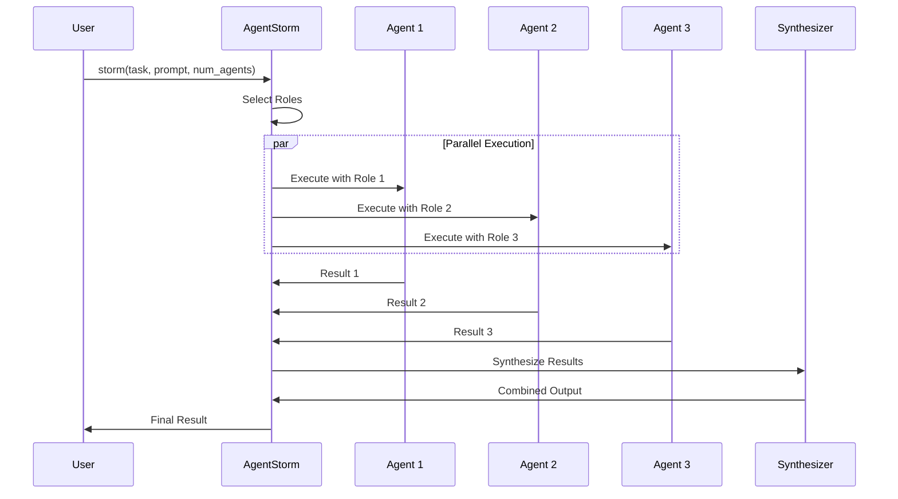

### Usage Examples

#### Basic Storm

```python
from integrations import AgentStorm

storm = AgentStorm()

result = storm.storm(
    task="Design a user authentication system",
    prompt="Create a comprehensive solution with security best practices",
    num_agents=4,
)

print(result["synthesis"]["synthesis"])
```

#### Storm with Specific Roles

```python
result = storm.storm_with_roles(
    task="Implement REST API for user management",
    prompt="Create CRUD operations with proper validation",
    roles=["backend", "security", "testing"],
)
```

#### Parallel Subtasks

```python
result = storm.parallel_tasks(
    task="Build user management feature",
    subtasks=[
        "Design database schema",
        "Create API endpoints",
        "Implement authentication",
        "Write tests",
    ],
)
```

### Synthesis Process

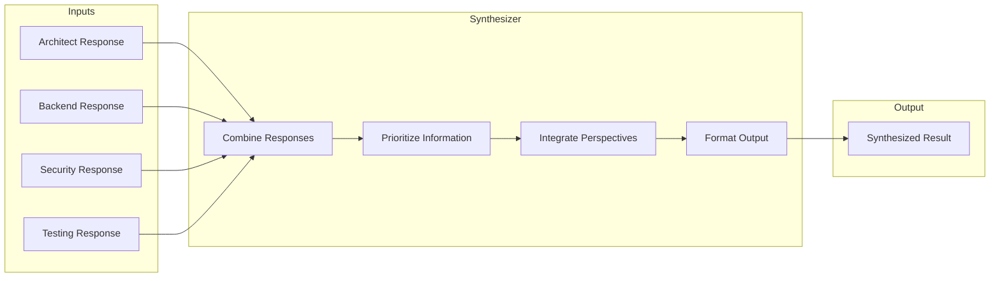

### Configuration

```python
from integrations.agent_storm import AgentStormConfig, AgentRole

# Custom configuration
config = AgentStormConfig(
    model="qwen2.5-coder",
    base_url="http://localhost:11434",
    num_agents=4,
    max_workers=4,          # Parallel threads
    synthesizer_model="qwen2.5-coder",
    timeout=300,            # 5 minutes total
)

storm = AgentStorm(config)

# Custom roles
custom_roles = [
    AgentRole(
        name="api-designer",
        system_prompt="You are an API design expert...",
        focus="RESTful API design",
    ),
    AgentRole(
        name="database-expert",
        system_prompt="You are a database optimization expert...",
        focus="Query optimization and schema design",
    ),
]

result = storm.storm(
    task="Build high-performance API",
    prompt="Design for 10k requests/second",
    custom_roles=custom_roles,
)
```

---

## Orchestrator Workflow

### Overview

The Orchestrator Agent manages complex tasks by switching between specialized modes and coordinating between different agent types.

### Mode Switching Logic

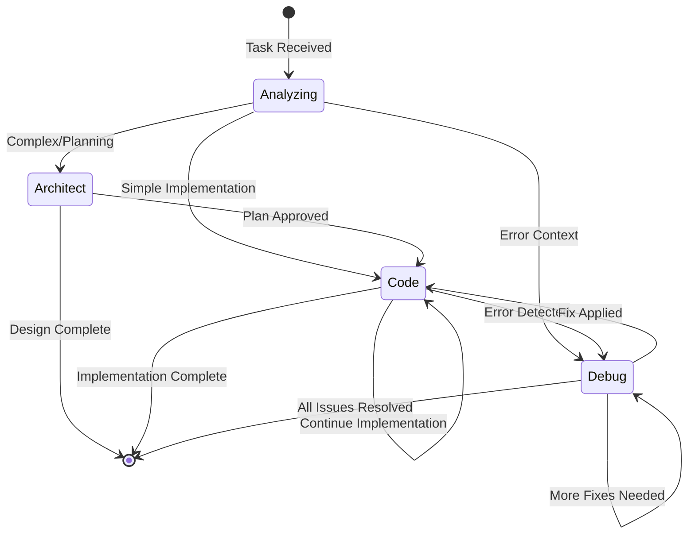

### Auto Mode Decision Tree

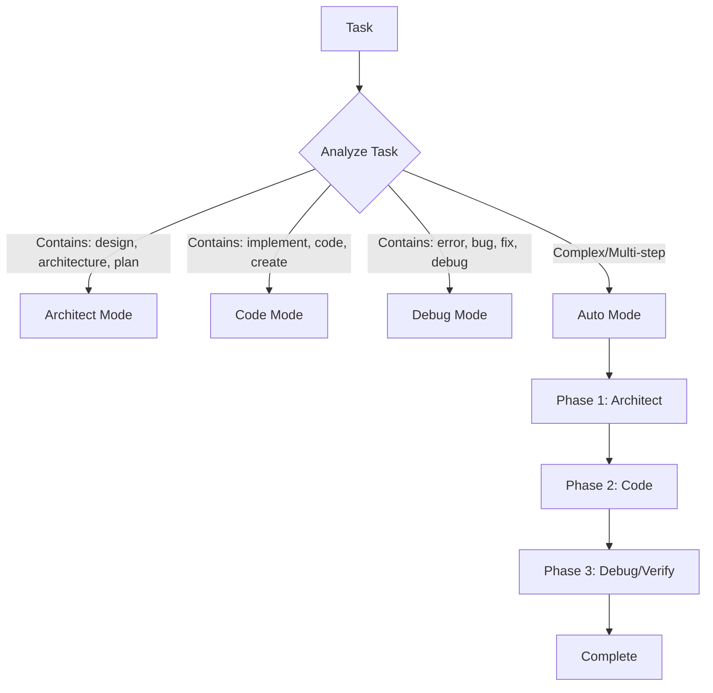

### Usage Examples

#### Mode-Specific Execution

```python
from integrations import Orchestrator

orchestrator = Orchestrator()

# Architect mode - for planning
plan = orchestrator.execute(
    task="Design the authentication system architecture",
    mode="architect",
)

# Code mode - for implementation
impl = orchestrator.execute(
    task="Implement the login endpoint",
    mode="code",
    context={"plan": plan["output"]},
)

# Debug mode - for fixing issues
fix = orchestrator.execute(
    task="Fix the authentication timeout issue",
    mode="debug",
    context={"error_log": "..."},
)
```

#### Auto Mode (Recommended)

```python
result = orchestrator.execute(
    task="Implement user registration with email verification",
    mode="auto",
)

# Auto mode will:
# 1. Plan in Architect mode
# 2. Implement in Code mode
# 3. Verify and fix in Debug mode
```

### Context Passing

```python
# Pass context between modes
context = {
    "project_path": "/home/tbaltzakis/cloudless.gr",
    "tech_stack": ["Next.js", "TypeScript", "DynamoDB"],
    "requirements": ["OAuth2", "MFA", "Session management"],
    "constraints": ["Must work offline", "Mobile-first"],
}

result = orchestrator.execute(
    task="Design authentication flow",
    mode="architect",
    context=context,
)
```

---

## Terminal/Sandbox Workflow

### Overview

The Terminal and Sandbox agents provide secure command execution with configurable safety controls.

### Command Validation Flow

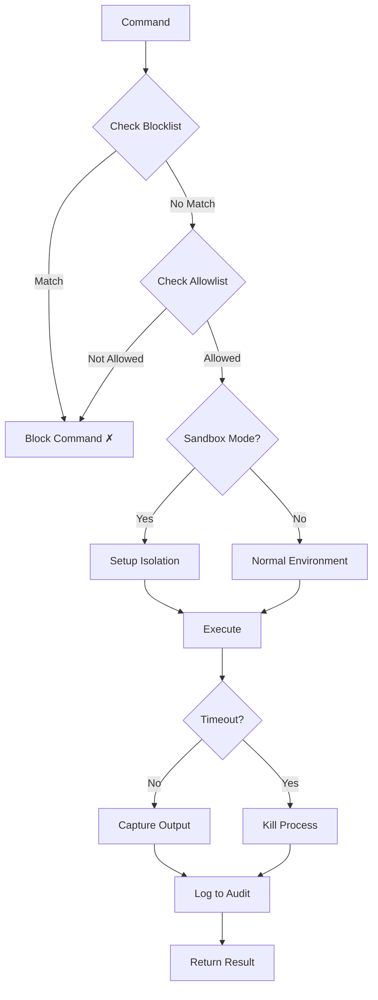

### Security Layers

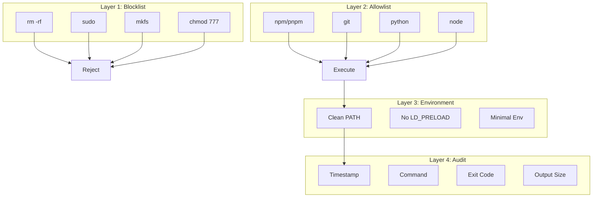

### Usage Examples

#### Terminal Agent

```python
from integrations import TerminalAgent

terminal = TerminalAgent()

# Execute command
result = terminal.execute("pnpm test")

print(f"Success: {result['success']}")
print(f"Output: {result['stdout']}")

# Parse test output
parsed = terminal.parse_output(result['stdout'], output_type="test")
print(f"Passed: {parsed['summary'].get('passed', 0)}")
print(f"Failed: {parsed['summary'].get('failed', 0)}")
```

#### Sandbox Agent

```python
from integrations import SandboxAgent

sandbox = SandboxAgent()

# Execute in sandbox
result = sandbox.execute("npm run build")

# Check audit log
log = sandbox.get_audit_log()
for entry in log:
    print(f"{entry['timestamp']}: {entry['command']}")

# Get statistics
stats = sandbox.get_statistics()
print(f"Blocked: {stats['blocked_commands']}")
print(f"Success Rate: {stats['success_rate']:.2%}")
```

#### Safe Arguments

```python
# Execute with validated arguments
result = sandbox.execute_safe(
    command="git",
    args=["checkout", "main"],
)
```

### Audit Log Format

```json
{
  "timestamp": "2026-07-03T15:30:00.000000",
  "type": "EXECUTION",
  "command": "pnpm test",
  "exit_code": 0,
  "stdout_length": 1234,
  "stderr_length": 0,
  "status": "SUCCESS"
}
```

---

## Debug Workflow

### Overview

The Debug Agent analyzes errors, identifies root causes, and generates fixes.

### Error Analysis Flow

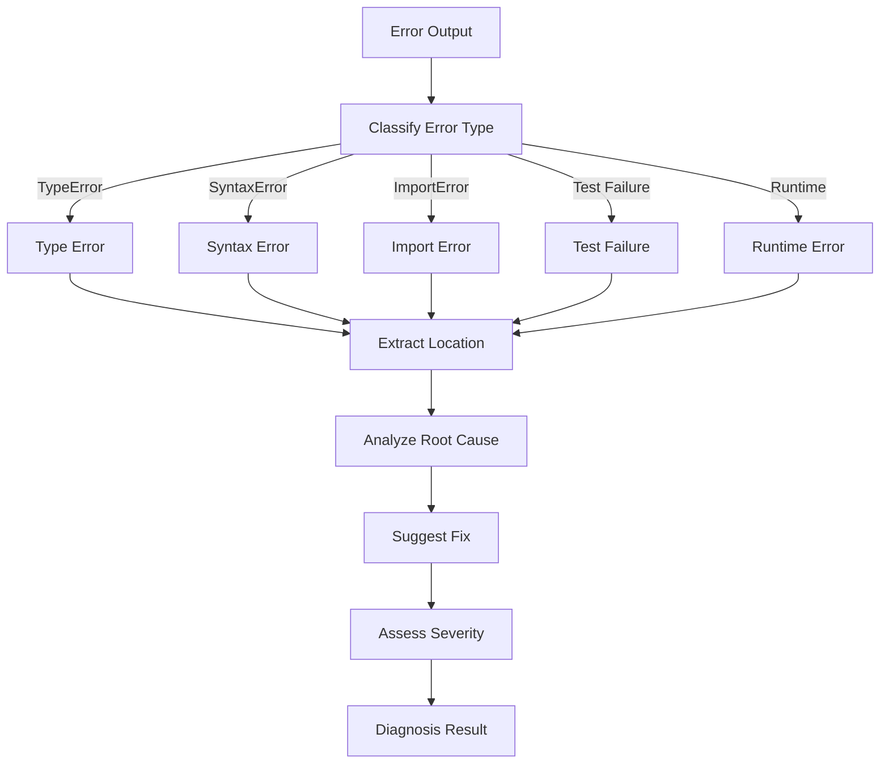

### Error Classification

| Error Type | Indicators | Typical Fix |
|------------|------------|-------------|
| **type_error** | `TypeError`, `undefined is not` | Type guards, null checks |
| **syntax_error** | `SyntaxError`, parse errors | Fix syntax, add missing tokens |
| **import_error** | `ImportError`, `ModuleNotFoundError` | Install package, fix path |
| **test_failure** | `FAIL`, `✕`, test names | Fix implementation or test |
| **compilation_error** | `error TS`, build failed | Fix type errors, syntax |

### Usage Examples

#### Error Analysis

```python
from integrations import DebugAgent

debugger = DebugAgent()

# Analyze error
error_output = """
TypeError: Cannot read properties of undefined (reading 'id')
    at UserController.getUser (src/controllers/user.ts:25:15)
"""

diagnosis = debugger.analyze_error(error_output, "src/controllers/user.ts")

print(f"Error Type: {diagnosis['error_type']}")
print(f"Root Cause: {diagnosis['root_cause']}")
print(f"Location: {diagnosis['location']}")
print(f"Suggested Fix: {diagnosis['suggested_fix']}")
print(f"Severity: {diagnosis['severity']}")
```

#### Log Analysis

```python
# Analyze log file
analysis = debugger.analyze_logs("/var/log/app.log")

print(f"Total Lines: {analysis['total_lines']}")
print(f"Summary: {analysis['summary']}")

for pattern in analysis['patterns_detected']:
    print(f"{pattern['pattern']}: {pattern['count']} occurrences")
```

#### Self-Fix

```python
# Generate and apply fix
result = debugger.self_fix(
    error_output=error_output,
    file_path="src/controllers/user.ts",
    test_command="pnpm test",
)

if result['fix_applied']:
    print("Fix applied successfully")
    print(f"Test passed: {result['test_passed']}")
```

---

## Web Research Workflow

### Overview

The Web Agent enables safe internet communication for research and data fetching.

### Request Flow

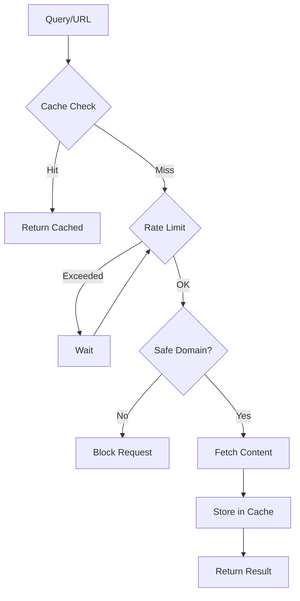

### Usage Examples

#### Web Search

```python
from integrations import WebAgent

web = WebAgent()

# Search for information
results = web.search("Next.js API route best practices", max_results=5)

for result in results:
    print(f"Title: {result['title']}")
    print(f"URL: {result['url']}")
    print(f"Snippet: {result['snippet'][:100]}...")
```

#### Fetch URL

```python
# Fetch specific page
content = web.fetch("https://nextjs.org/docs/app/building-your-application/routing")

if content['success']:
    print(content['content'][:500])
```

#### Research Topic

```python
# Multi-source research
research = web.research("DynamoDB best practices", sources=3)

print(f"Topic: {research['topic']}")
print(f"Sources: {len(research['sources_used'])}")

for finding in research['key_findings']:
    print(f"- {finding}")
```

#### Get API Documentation

```python
# Fetch API docs
docs = web.get_api_docs("stripe")

if docs['success']:
    print(docs['content'][:1000])
```

### Rate Limiting

```python
# Configure rate limiting
web = WebAgent(WebConfig(
    rate_limit=10,    # 10 requests per minute
    timeout=30,       # 30 second timeout
    cache_dir="/tmp/web_cache",
))
```

---

## Putting It All Together

### Complete Workflow Example

```python
from integrations import (
    TDDAgent,
    TerminalAgent,
    SandboxAgent,
    Orchestrator,
    WebAgent,
    DebugAgent,
    AgentStorm,
)

# 1. Research the problem
web = WebAgent()
research = web.research("JWT authentication best practices", sources=3)

# 2. Design the solution with Agent Storm
storm = AgentStorm()
design = storm.storm_with_roles(
    task="Implement JWT authentication",
    prompt="Use research findings",
    roles=["architect", "security", "backend"],
)

# 3. Implement with TDD
tdd = TDDAgent()
impl = tdd.run_tdd(
    feature="JWT authentication middleware",
    test_file="src/middleware/auth.test.ts",
    implementation_file="src/middleware/auth.ts",
)

# 4. Debug if needed
if impl['status'] == 'failed':
    debugger = DebugAgent()
    diagnosis = debugger.analyze_error(impl.get('error', ''), "src/middleware/auth.ts")
    print(f"Fix: {diagnosis['suggested_fix']}")

# 5. Verify with sandbox
sandbox = SandboxAgent()
result = sandbox.execute("pnpm test")
print(f"Tests: {'PASS' if result['success'] else 'FAIL'}")
```
